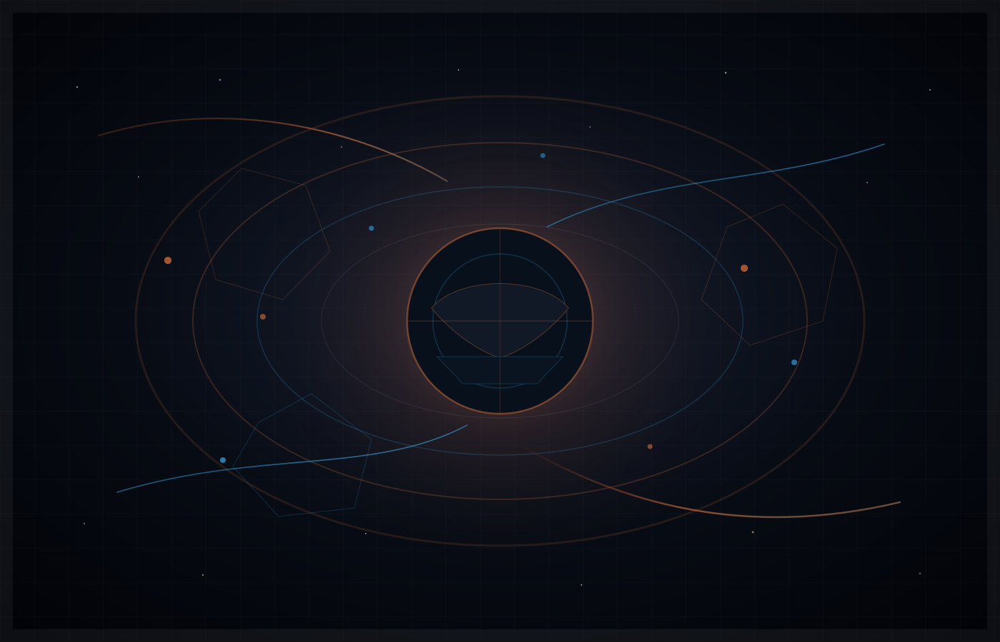
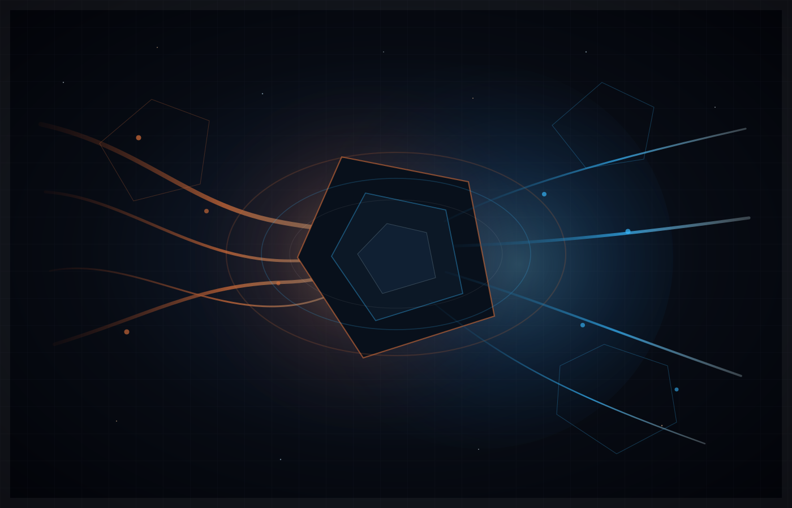
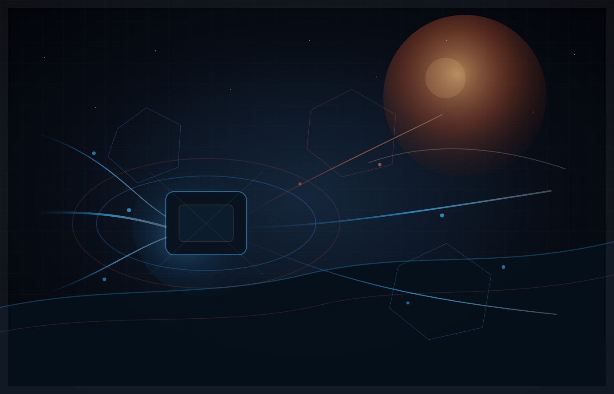

<h1 align="center">AresStack</h1>

  <strong>Efficiency is the new frontier.</strong> 
  German engineering, reimagined for the AI era.

  <em>Technē. Logos. Measure. Leverage.</em>

---

AresStack is shaped by a simple idea:

Powerful technology does not become useful through force alone.
It becomes useful when ambition meets architecture.

There is a reason why enterprise systems value structure, boundaries and reliability.
Uncertainty is expensive.
Complexity creates friction.
Scarcity makes every wasted hour, every hidden document and every disconnected workflow matter.

The old reflex was to answer uncertainty with more control.
The better answer is to build systems that make control less desperate.

The Greeks had useful words for this work:

**Technē** — craft, not spectacle.  
**Logos** — structure, not noise.  
**Phronēsis** — practical judgement, not blind automation.  
**Sōphrosynē** — measure, not excess.

Ares gives the name a hard edge.
Architecture gives it direction.

The symbol may look martial.
The direction is constructive:
engineering discipline turned toward efficiency, security and useful intelligence.

---

<table>
<tr>
<td width="42%">

</td>
<td width="58%">

## I. Scarcity

Scarcity has always shaped ambition.

When resources feel limited, when systems become too complex, when the future looks uncertain, people look for order.

For discipline.  
For structure.  
For tools that make the world smaller, clearer and more manageable.

Technology has always carried that promise.

It can extend reach.  
It can organize complexity.  
It can turn effort into leverage.

But every powerful lever raises the same question:

**What is it pointed at?**

</td>
</tr>
</table>

---

<table>
<tr>
<td width="58%">

## II. Redirection

The old answer to scarcity was control.

More command.  
More pressure.  
More expansion.  
More force applied to the outside world.

That impulse is understandable.
But it is not enough.

The better answer is efficiency.

More capability from existing systems.  
More knowledge from existing data.  
More time from better tools.  
More clarity from connected information.

AresStack stands for that redirection.

Take the discipline.  
Take the precision.  
Take the engineering seriousness.

Leave behind the obsession.

The task is not to control everything.
The task is to create systems with boundaries, intelligence with measure and infrastructure that people can trust.

</td>
<td width="42%">

</td>
</tr>
</table>

---

<table>
<tr>
<td width="42%">

</td>
<td width="58%">

## III. Leverage

What emerges is not a fantasy of domination.

It is room to move.

AI should become a lever for people and organizations:
to search better, decide faster, automate carefully and use existing knowledge with less friction.

The horizon is still there.
But the frontier has changed.

It is no longer about taking more space.

It is about creating more possibility from what is already here.

More usefulness from existing systems.  
More resilience from clear architecture.  
More speed without losing seriousness.  
More intelligence without surrendering judgement.

This is the AresStack direction:

**not spectacle, but engineering;  
not expansion, but efficiency;  
not blind automation, but measured intelligence.**

</td>
</tr>
</table>

---

  <strong>Strong enough to matter. Measured enough to trust.</strong>

